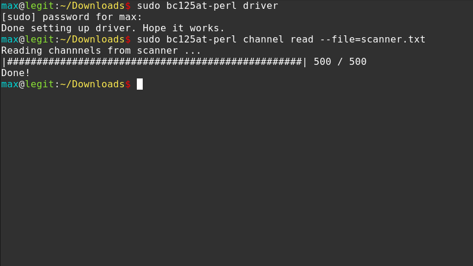
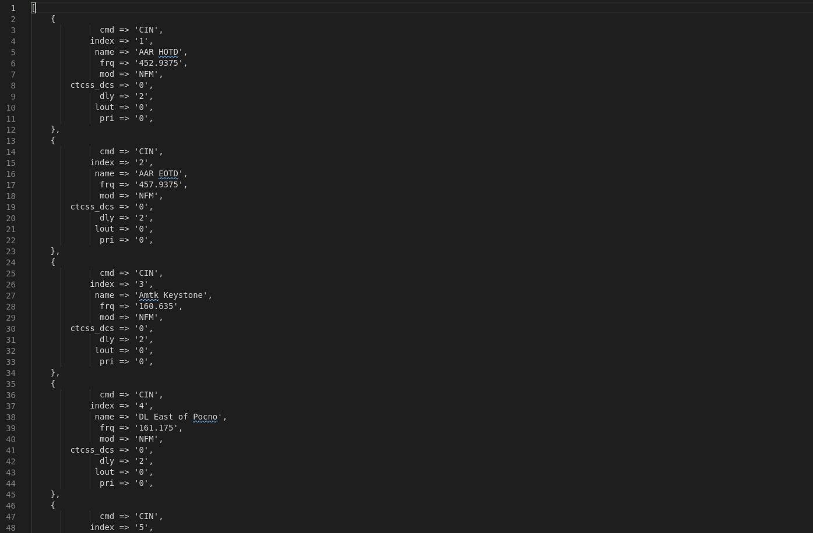
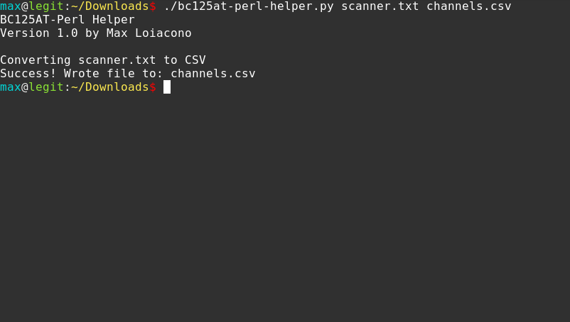
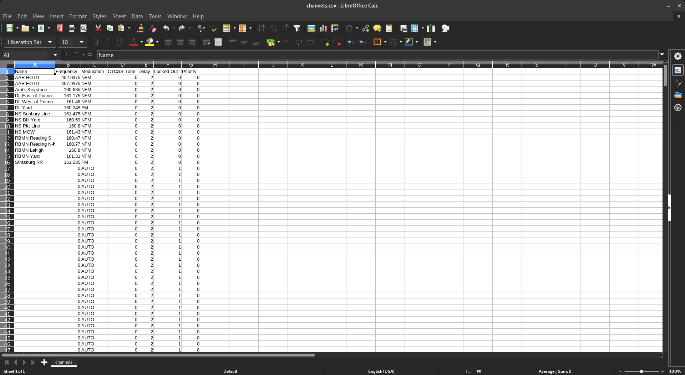
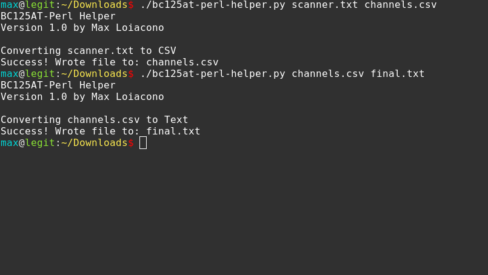
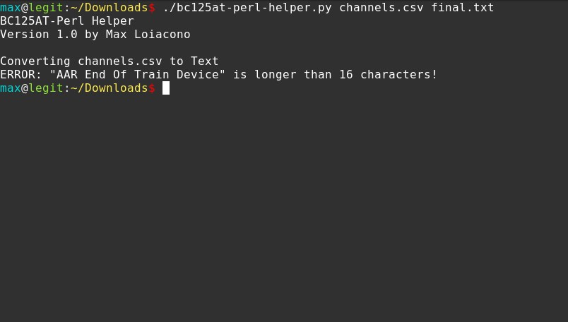
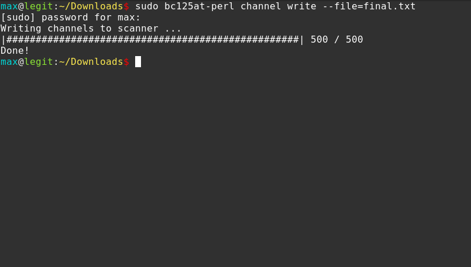

# BC125AT-Perl Helper

A tool to convert [bc125at-perl](http://www.rikus.org/bc125at-perl)'s output to CSV and back for easy editing.

# Installation
1. *BC125AT-Perl Helper* requires Python 3.
2. Download `bc125at-perl-helper.py`. You can run this file directly, or
3. Run `sudo cp bc125at-perl-helper.py /usr/bin/bc125at-perl-helper && sudo chmod +x /usr/bin/bc125at-perl-helper` to "install" this program.

# Features
* Converts `bc125at-perl`'s hard-to-read output to CSV (and back) for use in any spreadsheet editor.
* Includes **basic** validation (maximum name length, allowed modulations, etc...)

# Notes
* *BC125AT-Perl Helper* does **not** support quotations in names.
* *BC125AT-Perl Helper* does **not** support `=>` in names.
* *BC125AT-Perl Helper* is **not** a replacement or wrapper for `bc125at-perl`. You must properly install [bc125at-perl](http://www.rikus.org/bc125at-perl) first.
* **By default, all channels are offset by 1**. This means Bank 1 starts at row 2, Bank 2 starts at 52, etc...

# Tutorial
1. Read channels from your BC125AT like normal (with `bc125at-perl`)
	

2. `bc125at-perl`'s output is ugly, and hard to work with in any large capacity.
	

3. Run `bc125at-perl-helper <output from bc125at-perl> <new CSV file>` to convert `bc125at-perl`'s output to a CSV file.
	

4. Now you can open the generated CSV file in any spreadsheet editor of your choice, and take full advantages of features such as copying and pasting.
	

5. Run `bc125at-perl-helper <CSV file> <new text file>` to convert your edited CSV file back to `bc125at-perl`'s text format.
	

6. *BC125AT-Perl Helper* is capable of detecting and alerting you of some errors.
	

7. Finally, write the newly generated text file back to your BC125AT with `bc125at-perl`!
	